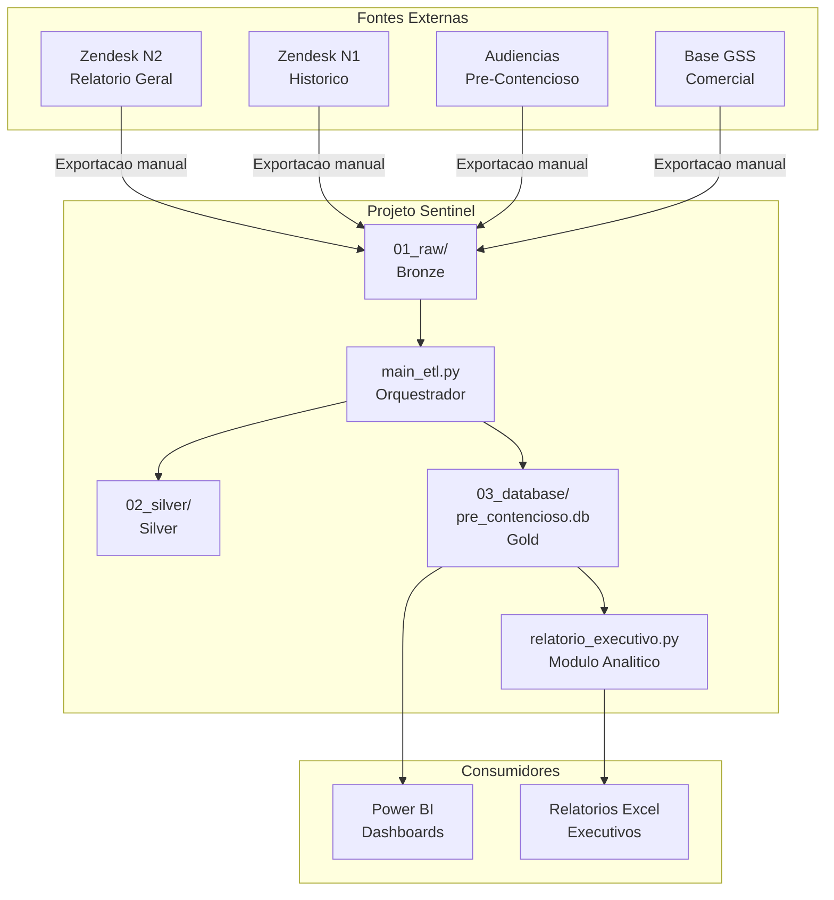

# Visao Geral do Projeto Sentinel

**Audiencia**: AMBOS (Desenvolvedores e Analistas)

[Voltar ao indice](README.md) | [Proximo: Arquitetura e Pipeline](02-arquitetura-pipeline.md)

---

## Objetivo

O Projeto Sentinel e uma plataforma de dados em Python + SQLite para consolidacao, tratamento, enriquecimento e persistencia analitica de tickets Zendesk relacionados a:

- **CX** (Customer Experience)
- **Pre-contencioso** (demandas judiciais e administrativas)
- **Manifestacoes institucionais** (Agenersa, Procon, Defensoria, Codecon, JEC)

O projeto foi estruturado como um **mini data warehouse operacional**, com foco em rastreabilidade de reclamacoes, preservacao do contexto transacional dos tickets, enriquecimento complementar com dados comerciais e entrega de uma base Gold consumivel por Power BI.

---

## Perguntas que o Banco Analitico Responde

O banco `pre_contencioso.db` foi desenhado para responder, com rastreabilidade:

1. Volume real de tickets por periodo e por canal
2. Evolucao de manifestacoes institucionais
3. Relacao entre NOTIFICACAO e SOLICITACAO
4. Produtividade operacional por analista
5. Funil de protocolos institucionais
6. Acompanhamentos com audiencia
7. Enriquecimento territorial e comercial por matricula

---

## Escopo Atual

O estado atual do projeto cobre quatro frentes:

| Frente | Descricao |
|---|---|
| **Ingestao dinamica** | Multiplos arquivos brutos em `01_raw/`, identificados por prefixo |
| **Tratamento e normalizacao** | Dados Zendesk N2, Zendesk N1, audiencias e GSS |
| **Persistencia relacional** | SQLite com UPSERT incremental em 10 tabelas |
| **Camada analitica** | Geracao de relatorios executivos em Excel |

O desenho privilegia **alteracoes aditivas**, **baixo acoplamento**, **reprocessamento seguro** e **compatibilidade com o consumo atual em BI**.

---

## Stack Tecnico

| Componente | Tecnologia | Finalidade |
|---|---|---|
| Linguagem | Python 3.10+ | Logica ETL e analitica |
| Processamento | Pandas | Transformacao de dados tabulares |
| Persistencia | SQLite | Banco Gold analitico |
| Leitura Excel | openpyxl | Leitura de arquivos .xlsx de entrada |
| Escrita Excel | xlsxwriter | Geracao de relatorios formatados |

---

## Estrutura de Diretorios

```text
Projeto_Sentinel/
|-- 01_raw/                          # Bronze: dados brutos do Zendesk e GSS
|-- 02_silver/                       # Silver: datasets tratados (auditoria)
|-- 03_database/
|   `-- pre_contencioso.db           # Gold: banco analitico SQLite
|-- outputs/                         # Relatorios executivos em Excel
|-- scripts/
|   |-- create_database.py           # Inicializacao do schema
|   |-- load_database.py             # UPSERT generico no SQLite
|   |-- main_etl.py                  # Orquestrador principal
|   |-- pipeline_common.py           # Utilitarios compartilhados
|   |-- pipeline_sources.py          # Descoberta dinamica de arquivos
|   |-- gss_matching.py              # Enriquecimento e matching GSS
|   `-- analytics/
|       |-- __init__.py
|       |-- queries.py               # Consultas SQL executivas
|       `-- relatorio_executivo.py   # Geracao de relatorio Excel
|-- MER_Projeto_Sentinel.mmd         # Diagrama ER em Mermaid
`-- README.md                        # Documentacao raiz
```

---

## Diagrama de Contexto do Sistema



---

[Voltar ao indice](README.md) | [Proximo: Arquitetura e Pipeline](02-arquitetura-pipeline.md)
