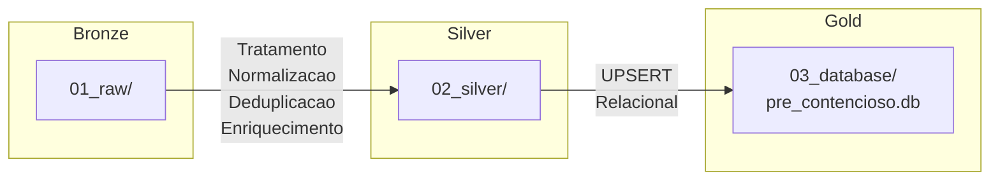
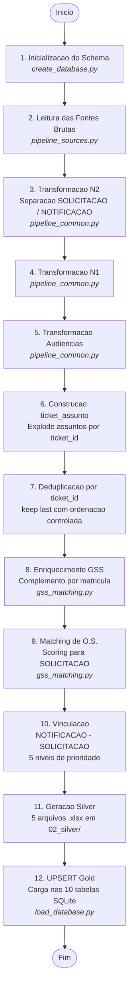
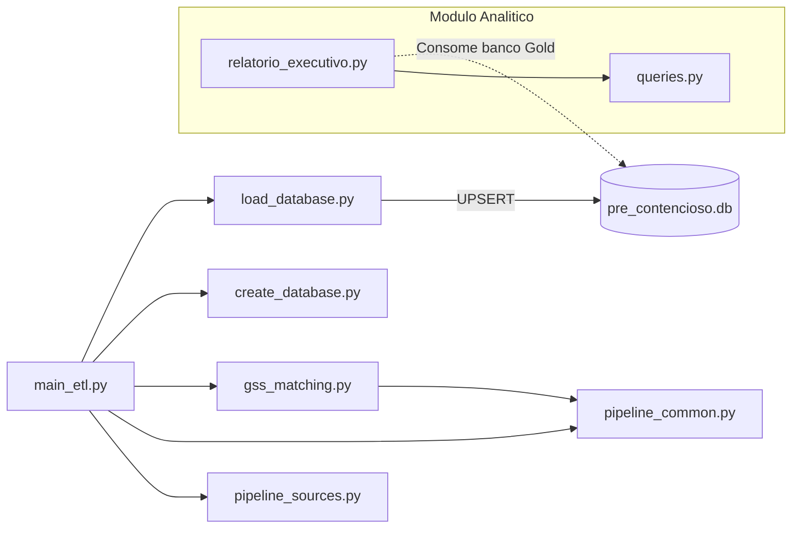

# Arquitetura e Pipeline ETL

**Audiencia**: DEV (primaria), ANALISTA (secundaria)

[Voltar ao indice](README.md) | [Anterior: Visao Geral](01-visao-geral.md) | [Proximo: Fontes de Dados](03-fontes-de-dados.md)

---

## Modelo Bronze - Silver - Gold

O Projeto Sentinel adota o paradigma de camadas de dados amplamente utilizado em engenharia de dados moderna:

| Camada | Diretorio | Conteudo | Responsabilidade |
|---|---|---|---|
| **Bronze** | `01_raw/` | Arquivos brutos exportados do Zendesk e GSS | Armazenamento sem transformacao. Aceita multiplos arquivos por fonte. |
| **Silver** | `02_silver/` | Datasets tratados em Excel | Normalizacao, deduplicacao, enriquecimento. Serve como auditoria intermediaria. |
| **Gold** | `03_database/pre_contencioso.db` | Banco SQLite relacional | Persistencia analitica final. Consumivel por Power BI e scripts. |

---

## Scripts e Responsabilidades

| Script | Responsabilidade Principal | Dependencias |
|---|---|---|
| `main_etl.py` | Orquestrador do pipeline completo | Todos os demais scripts |
| `pipeline_sources.py` | Descoberta dinamica e leitura de arquivos brutos | Pandas, openpyxl |
| `pipeline_common.py` | Utilitarios compartilhados (normalizacao, deduplicacao) | Pandas |
| `gss_matching.py` | Enriquecimento por matricula e matching de O.S. | pipeline_common |
| `create_database.py` | Inicializacao e evolucao do schema SQLite | SQLite |
| `load_database.py` | UPSERT generico no banco Gold | Pandas, SQLite |
| `analytics/queries.py` | Consultas SQL para relatorios executivos | — |
| `analytics/relatorio_executivo.py` | Geracao de relatorio Excel | queries.py, xlsxwriter |

---

## Fluxo ETL Completo — Passo a Passo

O `main_etl.py` executa a seguinte sequencia:

### Detalhamento por Etapa

| Etapa | Descricao | Entrada | Saida | Script |
|---|---|---|---|---|
| **1** | Cria banco e tabelas se nao existirem. Aplica `ALTER TABLE` aditivo para novas colunas. | Schema esperado | `pre_contencioso.db` atualizado | `create_database.py` |
| **2** | Localiza arquivos por prefixo em `01_raw/`. Le Excel para DataFrames. Concatena multiplos arquivos da mesma fonte. | Arquivos em `01_raw/` | 4 DataFrames brutos | `pipeline_sources.py` |
| **3** | Normaliza colunas do N2. Separa SOLICITACAO e NOTIFICACAO por prefixo de `formulario_ticket`. Aplica arquivamento logico de ANEXO. Extrai protocolos institucionais. | DataFrame N2 bruto | 2 DataFrames: solic + notif | `pipeline_common.py` |
| **4** | Normaliza colunas do N1. Arquiva em estrutura separada. | DataFrame N1 bruto | DataFrame N1 tratado | `pipeline_common.py` |
| **5** | Normaliza colunas de audiencias. Padroniza datas e campos de preposto. | DataFrame audiencias bruto | DataFrame audiencias tratado | `pipeline_common.py` |
| **6** | Para cada `ticket_id` com multiplos assuntos, explode em linhas distintas. Gera `ticket_assunto_id`, `ordem_assunto`, `flag_assunto_principal`. | DataFrame solic/notif | DataFrame ticket_assunto | `main_etl.py` |
| **7** | Remove duplicatas mantendo a ultima ocorrencia. Atualiza `qtde_assuntos_ticket` e `flag_multiplos_assuntos`. | DataFrames com duplicatas | DataFrames deduplicados | `pipeline_common.py` |
| **8** | Para cada `matricula`, preenche campos vazios com dados do GSS (endereco, contato). Nao sobrescreve valores validos. | DataFrame solic + GSS filtrado | DataFrame solic enriquecido | `gss_matching.py` |
| **9** | Quando `numero_os` ausente, busca candidatas no GSS por matricula. Calcula score (data + texto + status). Aceita automaticamente com margem suficiente. | DataFrame solic + GSS | DataFrame solic com O.S. | `gss_matching.py` |
| **10** | Vincula NOTIFICACAO a SOLICITACAO com 5 niveis de prioridade e janela de 7 dias. Classifica residuais como AMBIGUO/SEM_VINCULO. | DataFrames solic + notif + vinculos_manuais | DataFrame relacionamentos | `main_etl.py` |
| **11** | Gera 5 arquivos Excel tratados em `02_silver/`. Remove arquivos legados automaticamente. | DataFrames finais | Arquivos .xlsx | `main_etl.py` |
| **12** | Executa UPSERT em todas as tabelas Gold via tabela temporaria Pandas. | DataFrames finais | Registros em SQLite | `load_database.py` |

---

## Dependencia entre Scripts

---

## Arquivos Silver Gerados

### Saidas atuais em `02_silver/`

| Arquivo | Conteudo |
|---|---|
| `ANALYTICS_BASE_TICKETS_GERAL_processed.xlsx` | Todos os tickets N2 tratados (SOLICITACAO + NOTIFICACAO consolidados) |
| `ANALYTICS_BASE_TICKETS_N1_processed.xlsx` | Tickets N1 tratados |
| `PRE_CONTENCIOSO_AUDIENCIAS_processed.xlsx` | Audiencias tratadas |
| `ANALYTICS_BASE_TICKETS_ASSUNTOS_processed.xlsx` | Assuntos explodidos por ticket |
| `ANALYTICS_BASE_TICKETS_VINCULOS_processed.xlsx` | Resultado da vinculacao NOTIFICACAO-SOLICITACAO |

### Arquivos legados removidos automaticamente

Os seguintes arquivos de versoes anteriores sao removidos pelo ETL ao detectar sua presenca:

- `ANALYTICS_BASE_TICKETS_GERAL_SOLICITACAO_processed.xlsx`
- `ANALYTICS_BASE_TICKETS_GERAL_NOTIFICACAO_processed.xlsx`
- `ANALYTICS_BASE_TICKETS_processed.xlsx`
- `ANALYTICS_BASE_TICKETS_NOTIFICACAO_processed.xlsx`
- `Base_GSS_processed.xlsx`

---

[Voltar ao indice](README.md) | [Anterior: Visao Geral](01-visao-geral.md) | [Proximo: Fontes de Dados](03-fontes-de-dados.md)
