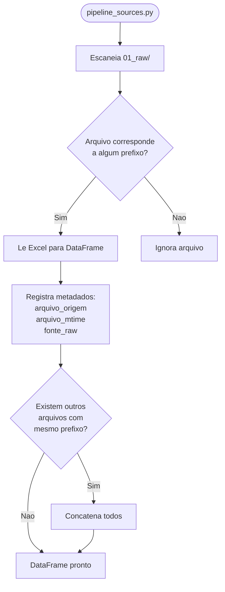
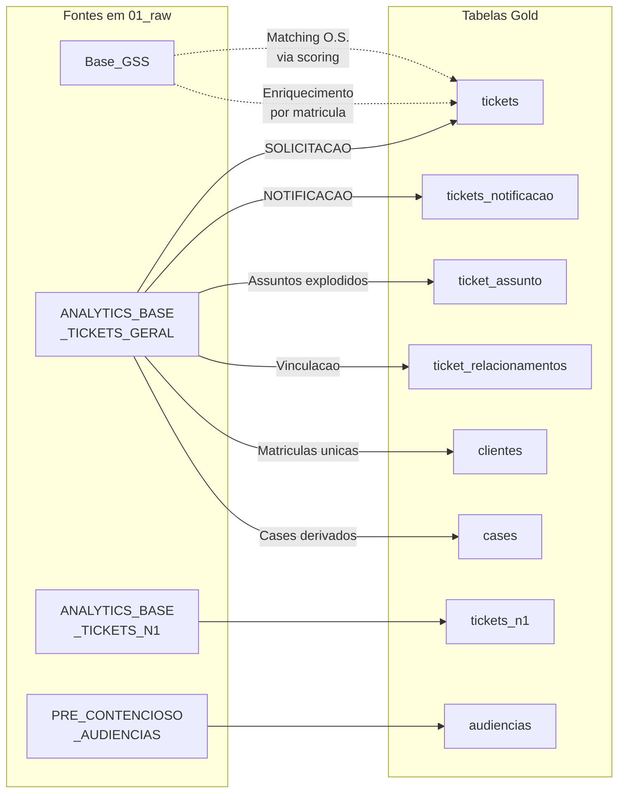

# Fontes de Dados

**Audiencia**: AMBOS (Desenvolvedores e Analistas)

[Voltar ao indice](README.md) | [Anterior: Arquitetura](02-arquitetura-pipeline.md) | [Proximo: Regras de Negocio](04-regras-de-negocio.md)

---

## Visao Geral

O Projeto Sentinel consome 4 fontes de dados distintas, todas ingeridas manualmente como arquivos Excel no diretorio `01_raw/`:

| Fonte | Prefixo Obrigatorio | Formato | Conteudo Principal |
|---|---|---|---|
| Zendesk N2 | `ANALYTICS_BASE_TICKETS_GERAL` | .xlsx | Tickets SOLICITACAO + NOTIFICACAO |
| Zendesk N1 | `ANALYTICS_BASE_TICKETS_N1` | .xlsx | Tickets nivel 1 (historico) |
| Audiencias | `PRE_CONTENCIOSO_AUDIENCIAS` | .xlsx | Agenda de audiencias judiciais/administrativas |
| GSS | `Base_GSS` | .xlsx | Base comercial para enriquecimento |

---

## 1. Zendesk N2 — Relatorio Geral

**Prefixo**: `ANALYTICS_BASE_TICKETS_GERAL`

Este e o relatorio principal do pipeline. Contem na **mesma extracao**:

- Tickets de **SOLICITACAO** (reclamacoes e demandas)
- Tickets de **NOTIFICACAO** (comunicacoes formais)
- Informacoes operacionais completas do N2
- Campo `formulario_ticket` para separacao logica dos dois universos

**Observacoes importantes:**

- O ETL **nao gera mais** dois arquivos Silver separados para N2
- O Silver consolidado permanece em arquivo unico
- A separacao SOLICITACAO/NOTIFICACAO ocorre **internamente** no ETL para fins de carga no banco
- A identificacao usa **prefixo normalizado** do `formulario_ticket` (nao igualdade literal), suportando valores como `Solicitacoes` e `Notificacoes`

**Tabelas Gold alimentadas:** `tickets`, `tickets_notificacao`, `ticket_assunto`, `ticket_relacionamentos`, `clientes`, `cases`

---

## 2. Zendesk N1

**Prefixo**: `ANALYTICS_BASE_TICKETS_N1`

Dados do nivel 1 de atendimento Zendesk. Armazenado **separadamente** em `tickets_n1`.

- **Nao compoe** a operacao principal do N2
- **Nao interfere** nos indicadores operacionais
- Objetivo: arquivamento tecnico e manutencao historica para conciliacoes futuras

**Tabela Gold alimentada:** `tickets_n1`

---

## 3. Audiencias

**Prefixo**: `PRE_CONTENCIOSO_AUDIENCIAS`

Fonte dedicada para dados de audiencias judiciais e administrativas:

| Campo | Descricao |
|---|---|
| Data da audiencia | Data agendada para a sessao |
| Reagendamento | Data de reagendamento, quando aplicavel |
| Preposto | Representante designado |
| Local | Local da audiencia (ex: Procon) |
| Tipo de audiencia | Classificacao da audiencia |
| Chaves de relacionamento | Campos que vinculam ao ticket correspondente |

**Tabela Gold alimentada:** `audiencias`

---

## 4. GSS / Base Comercial

**Prefixo**: `Base_GSS`

Base comercial utilizada para enriquecimento complementar. **Nao e persistida integralmente** no Gold.

**Uso atual:**

| Funcao | Descricao |
|---|---|
| Enriquecimento por matricula | Preenche campos vazios (endereco, contato) sem sobrescrever dados Zendesk |
| Apoio a O.S. ausente | Matching de Ordem de Servico via scoring quando ausente no Zendesk |
| Complemento de endereco | Bairro, municipio, logradouro, numero, complemento |
| Complemento de contato | Telefone, nome do cliente, nome do requerente |

**Uso NAO adotado no desenho atual:**

- A base GSS **nao e carregada integralmente** como Silver operacional
- A base GSS **nao e mais persistida integralmente** como parte ativa do fluxo Gold
- O ETL filtra a base bruta apenas para as **matriculas relevantes** aos tickets da carga

**Tabela Gold legada:** `gss_ordens_servico` (mantida por compatibilidade, nao atualizada ativamente)

---

## Descoberta Dinamica de Arquivos

O modulo `pipeline_sources.py` localiza automaticamente os arquivos por prefixo e extensao suportada.

### Comportamento

### Caracteristicas

- **Multiplos arquivos por prefixo**: aceita mais de um arquivo para a mesma fonte
- **Variacoes de nome**: tolera sufixo, data e versao no nome do arquivo
- **Metadados de rastreabilidade**: registra `arquivo_origem`, `arquivo_mtime` e `fonte_raw` no momento da leitura
- **Concatenacao automatica**: todos os arquivos de mesma fonte sao concatenados antes da transformacao

---

## Mapa Fonte -> Tabelas Destino

**Legenda:**
- Setas solidas: carga direta
- Setas tracejadas: enriquecimento complementar (nao gera linhas, apenas preenche campos)

---

[Voltar ao indice](README.md) | [Anterior: Arquitetura](02-arquitetura-pipeline.md) | [Proximo: Regras de Negocio](04-regras-de-negocio.md)
