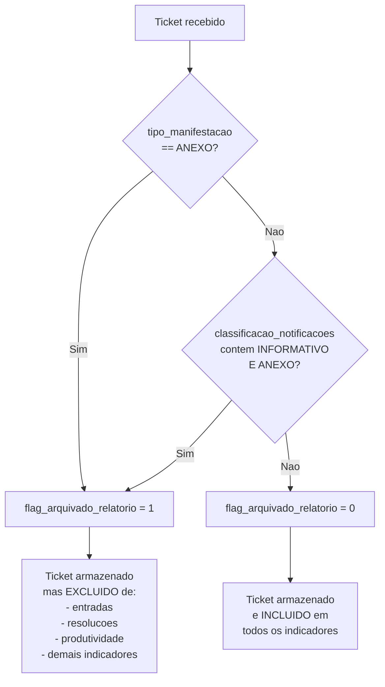
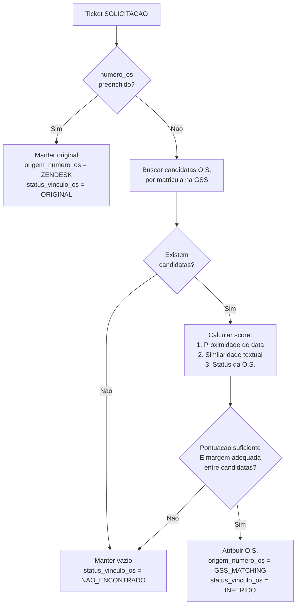
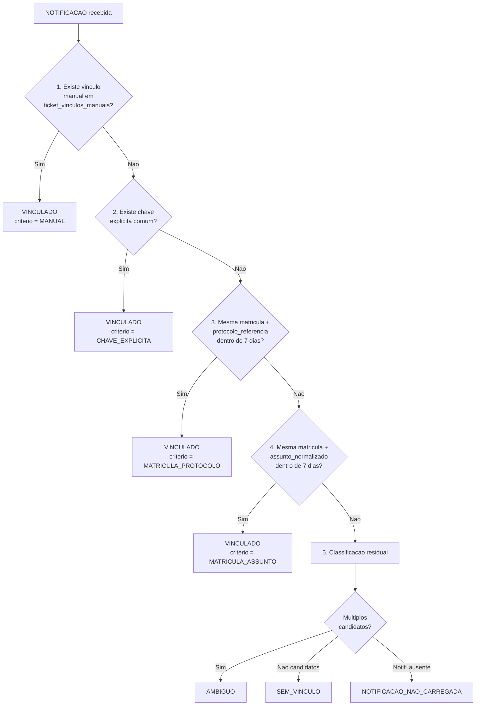

# Regras de Negocio

**Audiencia**: AMBOS (Desenvolvedores e Analistas) — documento critico para ambos os perfis.

[Voltar ao indice](README.md) | [Anterior: Fontes de Dados](03-fontes-de-dados.md) | [Proximo: Esquema do Banco](05-esquema-banco-de-dados.md)

---

## Sumario

- [4.1 Classificacao SOLICITACAO vs NOTIFICACAO](#41-classificacao-solicitacao-vs-notificacao)
- [4.2 Arquivamento Logico de ANEXO](#42-arquivamento-logico-de-anexo)
- [4.3 Protocolos Institucionais e Chaves Analiticas](#43-protocolos-institucionais-e-chaves-analiticas)
- [4.4 Duplicidade de Assuntos por Ticket](#44-duplicidade-de-assuntos-por-ticket)
- [4.5 Isolamento do N1](#45-isolamento-do-n1)
- [4.6 Enriquecimento GSS por Matricula](#46-enriquecimento-gss-por-matricula)
- [4.7 Matching de O.S. via GSS](#47-matching-de-os-via-gss)
- [4.8 Vinculacao NOTIFICACAO-SOLICITACAO](#48-vinculacao-notificacao-solicitacao)
- [4.9 Derivacao da Coluna Bloco](#49-derivacao-da-coluna-bloco)
- [4.10 Persistencia UPSERT](#410-persistencia-upsert)

---

## 4.1 Classificacao SOLICITACAO vs NOTIFICACAO

O relatorio `ANALYTICS_BASE_TICKETS_GERAL` contem ambos os tipos de ticket na mesma extracao. O ETL os separa internamente para carga em tabelas distintas.

**Regra de classificacao:**

- Utiliza o campo `formulario_ticket`
- A identificacao e feita por **prefixo normalizado** (nao igualdade literal)
- Suporta valores reais como `Solicitacoes` e `Notificacoes`

| Prefixo normalizado | Classificacao | Tabela destino |
|---|---|---|
| `solicit` | SOLICITACAO | `tickets` |
| `notific` | NOTIFICACAO | `tickets_notificacao` |

**Normalizacao aplicada ao prefixo:**

1. Remocao de acentos
2. Conversao para minusculas
3. Comparacao por prefixo (`.startswith()`)

---

## 4.2 Arquivamento Logico de ANEXO

Tickets classificados como ANEXO **nao sao removidos** do banco. Sao arquivados logicamente e ficam fora dos numeradores analiticos.



**Condicoes para arquivamento (OR logico):**

| Condicao | Descricao |
|---|---|
| `tipo_manifestacao = 'ANEXO'` | Campo indica tipo de manifestacao como anexo |
| `classificacao_notificacoes` contem `INFORMATIVO` **E** `ANEXO` | Ambos os termos presentes simultaneamente |

**Comportamento pos-arquivamento:**

- O ticket permanece no banco (nao e deletado)
- `flag_arquivado_relatorio = 1`
- **Nao deve compor**: entrada, resolucao, produtividade ou demais indicadores finais
- Para analises operacionais, sempre filtrar `flag_arquivado_relatorio = 0`

---

## 4.3 Protocolos Institucionais e Chaves Analiticas

O ETL extrai e preserva protocolos de orgaos institucionais a partir dos tickets:

| Protocolo | Campo | Orgao |
|---|---|---|
| Agenersa | `protocolo_agenersa` | Agencia Reguladora de Energia e Saneamento |
| Procon | `protocolo_procon` | Orgao de Defesa do Consumidor |
| Defensoria | `protocolo_defensoria` | Defensoria Publica |
| Codecon | `protocolo_codecon` | Codecon |

**Geracao do `case_jec`:** identificador para Juizado Especial Civel, derivado do contexto do ticket.

### Regra de definicao do `case_id`

O `case_id` e a chave principal de agrupamento logico de tickets:

```
SE protocolo_agenersa nao e nulo:
    case_id = protocolo_agenersa
SENAO:
    case_id = ticket_id
```

**Prioridade absoluta** para `protocolo_agenersa`. Tickets sem protocolo institucional sao agrupados individualmente pelo proprio `ticket_id`.

---

## 4.4 Duplicidade de Assuntos por Ticket

### Problema

O Zendesk pode replicar a mesma reclamacao em **varias linhas** quando o mesmo `ticket_id` possui mais de uma tabulacao de assunto.

### Decisao Arquitetural

| Tabela | Grao | Finalidade |
|---|---|---|
| `tickets` | 1 linha por `ticket_id` | Contagem operacional correta |
| `ticket_assunto` | 1 linha por assunto por ticket | Rastreabilidade real de todos os assuntos |

### Campos de suporte na tabela `tickets`

| Campo | Tipo | Descricao |
|---|---|---|
| `qtde_assuntos_ticket` | INTEGER | Quantidade total de assuntos distintos do ticket |
| `flag_multiplos_assuntos` | INTEGER | `1` se o ticket tem mais de um assunto, `0` caso contrario |

### Orientacao de uso

- **Para contar tickets**: usar tabela `tickets`
- **Para analisar assuntos**: usar tabela `ticket_assunto`
- **No Power BI**: relacionar `ticket_assunto.ticket_id` -> `tickets.ticket_id` sem inflar volume

---

## 4.5 Isolamento do N1

O N1 (nivel 1 de atendimento) e processado e arquivado em tabela propria (`tickets_n1`):

- **Nao interfere** nos indicadores do N2
- **Nao participa** das regras de vinculacao, enriquecimento ou matching
- Trata-se de uma **camada historica/auxiliar**
- Mantida para necessidades futuras e conciliacoes

---

## 4.6 Enriquecimento GSS por Matricula

A base GSS complementa dados faltantes nos tickets Zendesk **sem sobrescrever valores validos existentes**.

### Regra fundamental

```
PARA CADA matricula no dataset de tickets:
    PARA CADA campo enriquecivel:
        SE campo esta vazio/nulo no ticket
           E existe valor util no GSS:
            preencher campo com valor do GSS
```

### Campos enriquecidos

| Campo | Tipo de dado | Origem GSS |
|---|---|---|
| `bairro` | Endereco | Bairro do cliente no GSS |
| `municipio` | Endereco | Municipio do cliente |
| `logradouro` | Endereco | Logradouro |
| `endereco` | Endereco | Endereco completo |
| `numero_porta` | Endereco | Numero da porta |
| `complemento` | Endereco | Complemento do endereco |
| `telefone` | Contato | Telefone de contato |
| `nome_cliente_gss` | Identificacao | Nome do cliente no GSS |
| `nome_requerente_gss` | Identificacao | Nome do requerente no GSS |

### Selecao da linha GSS por matricula

Quando uma matricula possui multiplas linhas no GSS, o ETL seleciona a mais coerente com base em:

1. **Completude informacional** — linha com mais campos preenchidos
2. `data_emissao` — data de emissao da O.S.
3. `data_execucao` — data de execucao
4. `data_agendamento` — data de agendamento
5. `gss_os_id` — identificador da O.S.

---

## 4.7 Matching de O.S. via GSS

Quando o campo `numero_os` **nao vem preenchido** no Zendesk, o ETL tenta inferir a Ordem de Servico correta.



### Criterios de scoring

| Criterio | Descricao |
|---|---|
| Proximidade de data | Distancia temporal entre data do ticket e datas da O.S. (emissao, execucao, agendamento) |
| Similaridade textual | Comparacao entre titulo/assunto do ticket e servico da O.S. |
| Status da O.S. | Peso diferenciado conforme status (executada, agendada, pendente, etc.) |

### Condicao de aceite automatico

A O.S. e atribuida automaticamente **somente quando**:

1. A pontuacao da melhor candidata e **suficiente** (acima do limiar)
2. A **margem** entre a primeira e a segunda candidata e **adequada** (evita ambiguidade)

### Campos de auditoria

| Campo | Descricao |
|---|---|
| `numero_os_original` | Valor original do Zendesk (pode ser nulo) |
| `numero_os_gss` | O.S. atribuida pelo matching GSS |
| `gss_os_id` | ID unico da O.S. na base GSS |
| `origem_numero_os` | `ZENDESK` ou `GSS_MATCHING` |
| `status_vinculo_os` | `ORIGINAL`, `INFERIDO` ou `NAO_ENCONTRADO` |
| `score_vinculo_os` | Pontuacao numerica do matching |
| `criterio_vinculo_os` | Descricao do criterio utilizado para o match |

---

## 4.8 Vinculacao NOTIFICACAO-SOLICITACAO

O modelo de dados preserva dois principios:

- A **SOLICITACAO** e o fato principal de analise
- A **NOTIFICACAO** e mantida para rastreabilidade e relacionamento

### Arvore de decisao — 5 niveis de prioridade



### Detalhamento dos niveis

| Nivel | Criterio | Descricao |
|---|---|---|
| **1** | `ticket_vinculos_manuais` | Overrides manuais cadastrados por usuario. Tem prioridade absoluta. |
| **2** | Chave explicita comum | Campo compartilhado entre SOLICITACAO e NOTIFICACAO que permite vinculo direto. |
| **3** | `matricula + protocolo_referencia` | Mesma matricula e mesmo protocolo de referencia, dentro da janela temporal. |
| **4** | `matricula + assunto_normalizado` | Mesma matricula e mesmo assunto normalizado, dentro da janela temporal. |
| **5** | Classificacao residual | Quando nenhum criterio anterior e satisfeito. |

### Configuracao

| Parametro | Valor | Descricao |
|---|---|---|
| Janela maxima de vinculo | **7 dias** | Diferenca maxima aceita entre datas de criacao |
| `data_entrada_reclamacao` | Acompanha `data_criacao` da SOLICITACAO | Data de referencia operacional |
| `data_criacao_notificacao` | Preservada da NOTIFICACAO original | Data real de criacao da notificacao |

### Campos resultantes na tabela `ticket_relacionamentos`

| Campo | Descricao |
|---|---|
| `ticket_solicitacao_id` | PK — ID da SOLICITACAO vinculada |
| `ticket_notificacao_id` | ID da NOTIFICACAO vinculada |
| `status_vinculo` | `VINCULADO`, `AMBIGUO`, `SEM_VINCULO` ou `NOTIFICACAO_NAO_CARREGADA` |
| `criterio_vinculo` | `MANUAL`, `CHAVE_EXPLICITA`, `MATRICULA_PROTOCOLO` ou `MATRICULA_ASSUNTO` |
| `confianca_vinculo` | Score numerico de confianca |
| `dias_defasagem_abertura` | Dias entre criacao da SOLICITACAO e da NOTIFICACAO |
| `quantidade_candidatos` | Numero de candidatos avaliados |
| `observacao` | Notas adicionais sobre o processo de vinculacao |

---

## 4.9 Derivacao da Coluna Bloco

Regra **absoluta** de negocio baseada no prefixo da matricula:

| Prefixo da matricula | Bloco derivado |
|---|---|
| `40` | `Bloco 4` |
| `10` | `Bloco 1` |
| Ausencia de matricula | `null` |

**Tabelas que contem a coluna `bloco`:**

- `tickets`
- `tickets_notificacao`
- `tickets_n1`
- `gss_ordens_servico` (legado de compatibilidade)

---

## 4.10 Persistencia UPSERT

Toda a carga no banco Gold utiliza operacao **UPSERT** (INSERT ou UPDATE por chave primaria):

| Tabela | Chave UPSERT |
|---|---|
| `clientes` | `matricula` |
| `cases` | `case_id` |
| `tickets` | `ticket_id` |
| `tickets_notificacao` | `ticket_id` |
| `tickets_n1` | `ticket_id` |
| `ticket_assunto` | `ticket_assunto_id` |
| `ticket_relacionamentos` | `ticket_solicitacao_id` |
| `audiencias` | `ticket_id` |

### Beneficios do UPSERT

| Beneficio | Descricao |
|---|---|
| **Reprocessamento seguro** | Reexecutar o ETL com os mesmos dados nao gera duplicatas |
| **Atualizacao incremental** | Novos dados atualizam registros existentes por chave |
| **Ausencia de duplicidade** | Chave primaria garante unicidade |
| **Compatibilidade com reposicoes** | Arquivos brutos podem ser substituidos e reprocessados |

### Mecanismo tecnico

1. DataFrame e carregado em tabela temporaria do Pandas
2. UPSERT executa `INSERT OR REPLACE` por chave primaria
3. Apenas colunas presentes no DataFrame sao atualizadas
4. Colunas ausentes no DataFrame preservam valores anteriores

---

[Voltar ao indice](README.md) | [Anterior: Fontes de Dados](03-fontes-de-dados.md) | [Proximo: Esquema do Banco](05-esquema-banco-de-dados.md)
