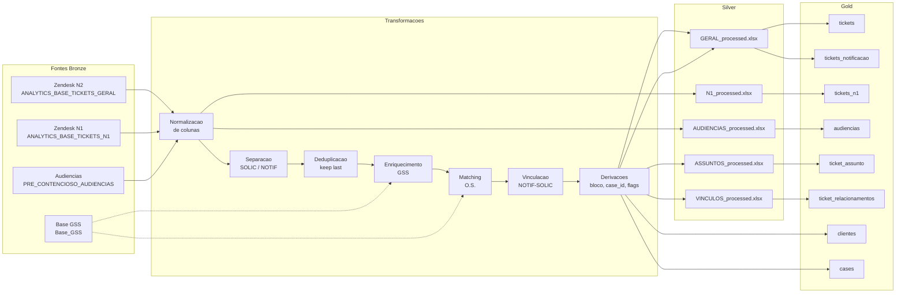
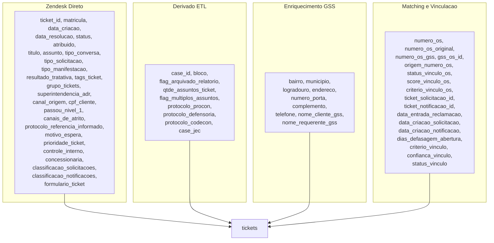

# Linhagem de Dados (Data Lineage)

**Audiencia**: DEV (primaria), ANALISTA (secundaria)

[Voltar ao indice](README.md) | [Anterior: Esquema do Banco](05-esquema-banco-de-dados.md) | [Proximo: Guia Operacional](07-guia-operacional.md)

---

## Conceito

A linhagem de dados rastreia a **origem e as transformacoes** aplicadas a cada campo do banco Gold. Isso permite:

- Entender de onde vem cada informacao
- Validar dados quando houver divergencia
- Avaliar impacto de mudancas nas fontes

---

## Linhagem Macro

---

## Linhagem da Tabela `tickets`

A tabela principal possui campos de **4 origens distintas**:

---

## Campos Enriquecidos por GSS

Os 9 campos abaixo sao preenchidos **somente quando vazios** no ticket Zendesk:

| Campo | Logica de preenchimento | Fonte GSS |
|---|---|---|
| `bairro` | Se vazio no Zendesk → preenche com GSS | `bairro` da O.S. mais coerente |
| `municipio` | Se vazio no Zendesk → preenche com GSS | `municipio` |
| `logradouro` | Se vazio no Zendesk → preenche com GSS | `nome_logradouro` |
| `endereco` | Se vazio no Zendesk → preenche com GSS | `endereco_requerente` |
| `numero_porta` | Se vazio no Zendesk → preenche com GSS | `numero_porta` |
| `complemento` | Se vazio no Zendesk → preenche com GSS | `complemento` |
| `telefone` | Se vazio no Zendesk → preenche com GSS | `telefone` |
| `nome_cliente_gss` | Sempre do GSS (campo exclusivo) | `nome_cliente` |
| `nome_requerente_gss` | Sempre do GSS (campo exclusivo) | `nome_requerente` |

**Criterio de selecao da linha GSS**: completude informacional > `data_emissao` > `data_execucao` > `data_agendamento` > `gss_os_id`

---

## Campos Derivados pelo ETL

Campos que nao existem na fonte e sao calculados durante o processamento:

| Campo | Regra de derivacao | Tabelas |
|---|---|---|
| `bloco` | Prefixo matricula: `40*`→Bloco 4, `10*`→Bloco 1, vazio→null | tickets, tickets_notificacao, tickets_n1, gss_ordens_servico |
| `case_id` | `protocolo_agenersa` se existir, senao `ticket_id` | tickets, cases |
| `flag_arquivado_relatorio` | 1 se ANEXO (regras da secao 4.2), 0 caso contrario | tickets, tickets_notificacao |
| `qtde_assuntos_ticket` | Contagem de assuntos distintos do ticket | tickets |
| `flag_multiplos_assuntos` | 1 se `qtde_assuntos_ticket > 1`, 0 caso contrario | tickets |
| `protocolo_procon` | Extraido do contexto do ticket | tickets, tickets_notificacao |
| `protocolo_defensoria` | Extraido do contexto do ticket | tickets, tickets_notificacao |
| `protocolo_codecon` | Extraido do contexto do ticket | tickets, tickets_notificacao |
| `case_jec` | Gerado para Juizado Especial Civel | tickets, tickets_notificacao |
| `assunto_normalizado` | Assunto apos normalizacao padrao | ticket_assunto |
| `ticket_assunto_id` | ID composto (ticket_id + assunto) | ticket_assunto |
| `ordem_assunto` | Posicao ordinal do assunto | ticket_assunto |
| `flag_assunto_principal` | 1 para primeiro assunto, 0 para demais | ticket_assunto |
| `servico_normalizado` | Servico apos normalizacao | gss_ordens_servico |

---

## Campos de Matching O.S.

Gerados pelo processo de matching com a base GSS:

| Campo | Derivacao | Presenca |
|---|---|---|
| `numero_os_original` | Valor original do Zendesk (preservado) | tickets |
| `numero_os_gss` | O.S. atribuida pelo matching | tickets |
| `numero_os` | Valor final (original ou inferido) | tickets |
| `gss_os_id` | ID da O.S. na base GSS | tickets |
| `origem_numero_os` | `ZENDESK` ou `GSS_MATCHING` | tickets |
| `status_vinculo_os` | `ORIGINAL`, `INFERIDO`, `NAO_ENCONTRADO` | tickets |
| `score_vinculo_os` | Pontuacao do matching | tickets |
| `criterio_vinculo_os` | Descricao do criterio de match | tickets |

---

## Campos de Vinculacao NOTIF-SOLIC

Gerados pelo processo de vinculacao entre NOTIFICACAO e SOLICITACAO:

| Campo | Derivacao | Presenca |
|---|---|---|
| `ticket_solicitacao_id` | ID da SOLICITACAO no vinculo | tickets, ticket_relacionamentos |
| `ticket_notificacao_id` | ID da NOTIFICACAO no vinculo | tickets, ticket_relacionamentos |
| `status_vinculo` | Resultado: VINCULADO, AMBIGUO, SEM_VINCULO, NOTIFICACAO_NAO_CARREGADA | tickets, ticket_relacionamentos |
| `criterio_vinculo` | Nivel usado: MANUAL, CHAVE_EXPLICITA, MATRICULA_PROTOCOLO, MATRICULA_ASSUNTO | tickets, ticket_relacionamentos |
| `confianca_vinculo` | Score numerico | tickets, ticket_relacionamentos |
| `data_entrada_reclamacao` | Segue `data_criacao` da SOLICITACAO | tickets, ticket_relacionamentos |
| `data_criacao_solicitacao` | Preservada da SOLICITACAO | tickets, ticket_relacionamentos |
| `data_criacao_notificacao` | Preservada da NOTIFICACAO | tickets, ticket_relacionamentos |
| `dias_defasagem_abertura` | Diferenca em dias | tickets, ticket_relacionamentos |
| `quantidade_candidatos` | Total de candidatos avaliados | ticket_relacionamentos |
| `observacao` | Notas do processo | ticket_relacionamentos |

---

## Campos de Auditoria

Metadados registrados automaticamente pelo ETL:

| Campo | Descricao | Tabelas |
|---|---|---|
| `arquivo_origem` | Nome do arquivo bruto de onde o registro foi lido | tickets_notificacao, tickets_n1, ticket_assunto, audiencias, gss_ordens_servico |
| `data_carga` | Timestamp do momento da carga no banco | tickets_notificacao, tickets_n1, ticket_assunto, gss_ordens_servico |
| `arquivo_mtime` | Data de modificacao do arquivo bruto | Registrado internamente (nao persistido como coluna) |
| `fonte_raw` | Identificador da fonte (prefixo do arquivo) | Registrado internamente (nao persistido como coluna) |

---

[Voltar ao indice](README.md) | [Anterior: Esquema do Banco](05-esquema-banco-de-dados.md) | [Proximo: Guia Operacional](07-guia-operacional.md)
