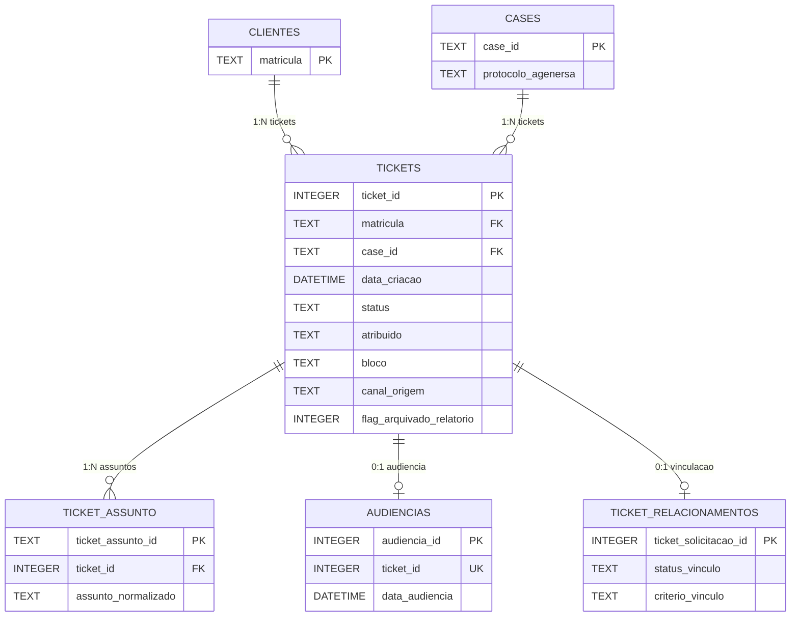

# Guia de Consumo para Analistas e BI

**Audiencia**: ANALISTA (Analistas de Dados e Power BI)

[Voltar ao indice](README.md) | [Anterior: Guia Operacional](07-guia-operacional.md) | [Proximo: Glossario](09-glossario.md)

---

## Conexao ao Banco

### Informacoes de conexao

| Propriedade | Valor |
|---|---|
| **Motor** | SQLite |
| **Caminho** | `03_database/pre_contencioso.db` |
| **Driver Power BI** | ODBC SQLite ou conector nativo |

### Como conectar no Power BI

1. Instalar driver SQLite ODBC (se nao houver conector nativo)
2. Power BI Desktop → **Obter Dados** → **Banco de Dados ODBC**
3. Configurar string de conexao apontando para `pre_contencioso.db`
4. Selecionar as tabelas desejadas

---

## Tabelas Disponiveis — Resumo Funcional

| Tabela | Para que serve | Quando usar |
|---|---|---|
| `tickets` | Fato principal — 1 linha por ticket SOLICITACAO | Analise de volume, produtividade, resolucao |
| `tickets_notificacao` | Tickets de NOTIFICACAO | Rastreabilidade de notificacoes |
| `ticket_assunto` | Todos os assuntos por ticket | Analise por assunto sem inflar volume |
| `ticket_relacionamentos` | Vinculo NOTIFICACAO ↔ SOLICITACAO | Analise de relacionamentos |
| `audiencias` | Agenda de audiencias | Acompanhamento judicial/administrativo |
| `clientes` | Matriculas unicas | Dimensao de clientes |
| `cases` | Agrupador logico | Analise por case/protocolo |
| `ticket_vinculos_manuais` | Overrides manuais | Auditoria de vinculos |
| `tickets_n1` | Historico N1 | Analise historica (isolada do N2) |
| `gss_ordens_servico` | Ordens de servico (legado) | Consulta historica apenas |

---

## Qual Tabela Usar — Guia por Caso de Uso

| Quero analisar... | Tabela principal | Filtro obrigatorio | Observacao |
|---|---|---|---|
| Volume de tickets por periodo | `tickets` | `flag_arquivado_relatorio = 0` | Usar `data_criacao` para periodo |
| Produtividade por analista | `tickets` | `flag_arquivado_relatorio = 0` | Agrupar por `atribuido` |
| Tempo de resolucao | `tickets` | `flag_arquivado_relatorio = 0` | Calcular `data_resolucao - data_criacao` |
| Distribuicao por assunto | `ticket_assunto` | — | Nao usar `tickets.assunto` para este fim |
| Tickets por canal de origem | `tickets` | `flag_arquivado_relatorio = 0` | Agrupar por `canal_origem` |
| Manifestacoes institucionais | `tickets` | `flag_arquivado_relatorio = 0` | Filtrar por `protocolo_agenersa`, `protocolo_procon`, etc. IS NOT NULL |
| Funil de protocolos | `tickets` | `flag_arquivado_relatorio = 0` | Contar por tipo de protocolo preenchido |
| Audiencias agendadas | `audiencias` | — | Usar `data_audiencia` |
| Vinculo NOTIFICACAO-SOLICITACAO | `ticket_relacionamentos` | — | Verificar `status_vinculo` |
| Vinculos ambiguos | `ticket_relacionamentos` | `status_vinculo = 'AMBIGUO'` | Para reconciliacao |
| Dados por bloco territorial | `tickets` | `flag_arquivado_relatorio = 0` | Agrupar por `bloco` |
| Historico N1 | `tickets_n1` | — | Tabela isolada do N2 |
| Enriquecimento GSS | `tickets` | — | Campos: `bairro`, `municipio`, `nome_cliente_gss`, etc. |

---

## Filtros Obrigatorios

### flag_arquivado_relatorio

**Regra critica**: Para **qualquer indicador operacional** (volume, entrada, resolucao, produtividade), aplicar:

```
flag_arquivado_relatorio = 0
```

Tickets com `flag_arquivado_relatorio = 1` sao ANEXOS e nao devem compor metricas operacionais.

---

## Modelo Estrela Sugerido para Power BI



### Configuracao de relacionamentos no Power BI

| Tabela fato | Campo | Tabela dimensao | Campo | Tipo |
|---|---|---|---|---|
| `tickets` | `matricula` | `clientes` | `matricula` | Muitos para Um |
| `tickets` | `case_id` | `cases` | `case_id` | Muitos para Um |
| `ticket_assunto` | `ticket_id` | `tickets` | `ticket_id` | Muitos para Um |
| `audiencias` | `ticket_id` | `tickets` | `ticket_id` | Um para Um |
| `ticket_relacionamentos` | `ticket_solicitacao_id` | `tickets` | `ticket_id` | Um para Um |

---

## Metricas Sugeridas

### Volume e Fluxo

| Metrica | Formula/Query |
|---|---|
| Total de tickets ativos | `COUNT(ticket_id) WHERE flag_arquivado_relatorio = 0` |
| Tickets por periodo | Agrupar por `data_criacao` (mes/semana) |
| Tickets resolvidos | `COUNT WHERE data_resolucao IS NOT NULL AND flag_arquivado_relatorio = 0` |
| Taxa de resolucao | Resolvidos / Total ativos |

### Produtividade

| Metrica | Formula/Query |
|---|---|
| Tickets por analista | `COUNT(ticket_id) GROUP BY atribuido` |
| Tempo medio de resolucao | `AVG(data_resolucao - data_criacao)` |

### Institucional

| Metrica | Formula/Query |
|---|---|
| Tickets com protocolo Agenersa | `COUNT WHERE protocolo_agenersa IS NOT NULL` |
| Tickets com protocolo Procon | `COUNT WHERE protocolo_procon IS NOT NULL` |
| Funil institucional | Contagem por tipo de protocolo preenchido |

### Territorial

| Metrica | Formula/Query |
|---|---|
| Tickets por bloco | `COUNT GROUP BY bloco` |
| Tickets por municipio | `COUNT GROUP BY municipio` |

---

## Armadilhas Comuns

### 1. Nao usar `tickets` para contar assuntos

**Errado**: `SELECT assunto, COUNT(*) FROM tickets GROUP BY assunto`

**Correto**: `SELECT assunto_normalizado, COUNT(*) FROM ticket_assunto GROUP BY assunto_normalizado`

**Motivo**: A tabela `tickets` tem 1 linha por ticket (assunto principal). A tabela `ticket_assunto` preserva todos os assuntos.

---

### 2. Nao comparar bruto com processado por contagem de linhas

O arquivo bruto pode ter mais linhas que `ticket_id` distintos no banco, porque tickets com multiplos assuntos geram repeticao na extracao Zendesk.

**Comparacao correta**: Sempre por `ticket_id` distinto.

---

### 3. Nao esquecer o filtro de arquivamento

Qualquer indicador operacional **sem** `flag_arquivado_relatorio = 0` incluira tickets ANEXO, inflando as metricas.

---

### 4. N1 e N2 sao independentes

A tabela `tickets_n1` e **isolada**. Nao combinar com `tickets` para metricas operacionais. O N1 e uma camada historica/auxiliar.

---

### 5. Campos de endereco podem vir de duas fontes

Os campos `bairro`, `municipio`, `logradouro`, `endereco`, `numero_porta`, `complemento` e `telefone` podem ser originais do Zendesk **ou** enriquecidos pelo GSS. Nao ha campo indicando a origem de cada valor individual.

Os campos `nome_cliente_gss` e `nome_requerente_gss` sao **exclusivamente** do GSS.

---

## Campos Uteis por Tema Analitico

### Analise operacional

`ticket_id`, `data_criacao`, `data_resolucao`, `status`, `atribuido`, `grupo_tickets`, `canal_origem`, `flag_arquivado_relatorio`

### Analise institucional

`protocolo_agenersa`, `protocolo_procon`, `protocolo_defensoria`, `protocolo_codecon`, `case_jec`, `case_id`, `tipo_manifestacao`

### Analise territorial

`bloco`, `bairro`, `municipio`, `logradouro`, `matricula`

### Analise de audiencias

`data_audiencia`, `data_reagendamento`, `preposto`, `local_procon`, `tipo_audiencia`

### Analise de vinculacao

`status_vinculo`, `criterio_vinculo`, `confianca_vinculo`, `dias_defasagem_abertura`, `ticket_notificacao_id`

### Analise de O.S.

`numero_os`, `origem_numero_os`, `status_vinculo_os`, `score_vinculo_os`

---

[Voltar ao indice](README.md) | [Anterior: Guia Operacional](07-guia-operacional.md) | [Proximo: Glossario](09-glossario.md)
