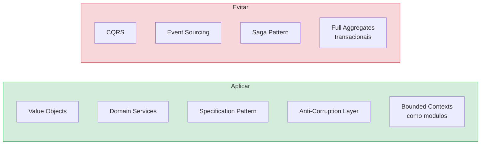
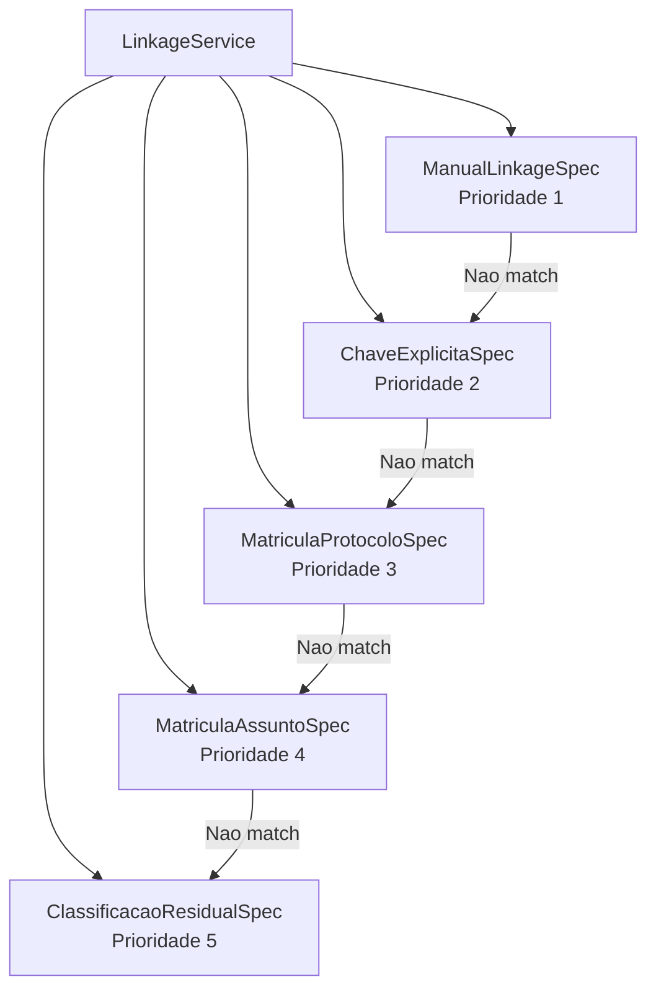
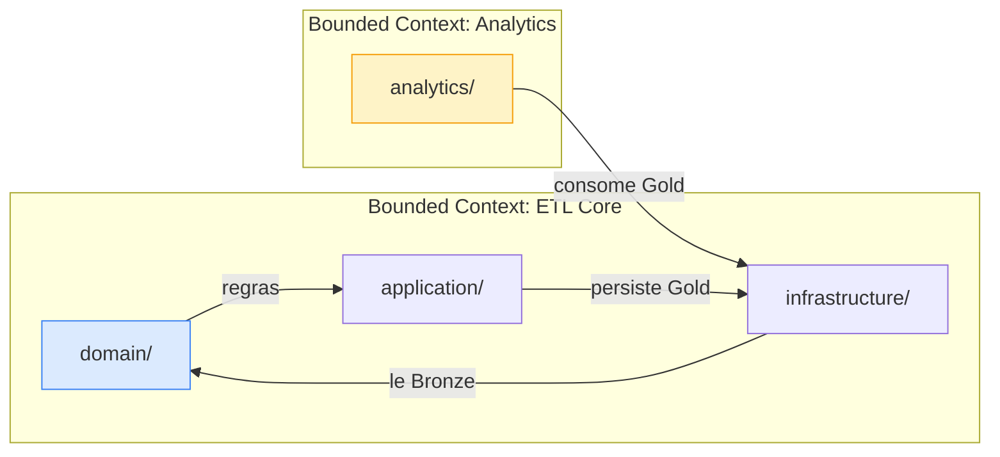
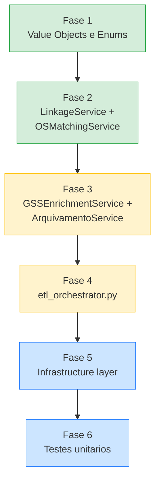

# Proposta de Refatoracao com Domain-Driven Design (DDD)

**Audiencia**: DEV (Desenvolvedores e Arquitetos)

[Voltar ao indice](README.md) | [Anterior: Glossario](09-glossario.md)

---

## Sumario

- [1. Contexto e Motivacao](#1-contexto-e-motivacao)
- [2. Veredicto: DDD-Lite](#2-veredicto-ddd-lite)
- [3. Padroes que se Aplicam](#3-padroes-que-se-aplicam)
- [4. Padroes a Evitar](#4-padroes-a-evitar)
- [5. Mapeamento Atual para DDD](#5-mapeamento-atual-para-ddd)
- [6. Estrutura Proposta](#6-estrutura-proposta)
- [7. Beneficios Concretos](#7-beneficios-concretos)
- [8. Trade-offs e Riscos](#8-trade-offs-e-riscos)
- [9. Plano de Migracao Incremental](#9-plano-de-migracao-incremental)
- [10. Exemplos de Implementacao](#10-exemplos-de-implementacao)
- [11. Referencias](#11-referencias)

---

## 1. Contexto e Motivacao

O Projeto Sentinel possui **complexidade de dominio real** que justifica a adocao de padroes DDD taticos:

- **Regras de negocio ricas**: Vinculacao NOTIFICACAO-SOLICITACAO com 5 niveis de prioridade, matching de O.S. por scoring, enriquecimento GSS com semantica de nao-sobrescrita, arquivamento logico de ANEXO, extracao de protocolos institucionais.
- **Linguagem ubiqua ja existente**: SOLICITACAO, NOTIFICACAO, ANEXO, matricula, bloco, case_id, protocolo_agenersa, vinculacao, score_vinculo_os — termos precisos de dominio que um modelo DDD formalizaria.
- **Logica em evolucao**: O README menciona proximos passos (views Gold, auditoria de vinculos ambiguos, versionamento de cargas). Conforme as regras crescem, scripts procedurais ficam mais dificeis de manter.
- **Multiplas origens alimentando conceitos compartilhados**: Zendesk N2, N1, GSS e Audiencias contribuem para um modelo de dominio unificado (tickets, clientes, cases).

### Problema atual

A logica de negocio esta **embutida em scripts procedurais**, dificultando:

- Testes unitarios de regras individuais
- Compreensao rapida de onde cada regra reside
- Evolucao segura sem efeitos colaterais

---

## 2. Veredicto: DDD-Lite

**Recomendacao: aplicar padroes taticos seletivamente, sem o aparato estrategico completo.**



**Razoes para DDD-Lite (nao DDD completo):**

| Fator | Implicacao |
|---|---|
| Equipe pequena / desenvolvedor unico | Aparato estrategico completo (multiplos bounded contexts com ACL entre servicos) seria over-engineering |
| ETL em batch, nao OLTP | Padroes transacionais (Unit of Work, Aggregate com consistencia) nao se aplicam naturalmente a DataFrames |
| Pandas como motor de processamento | Domain Services devem aceitar e retornar DataFrames — nao encapsular cada linha em objetos |

---

## 3. Padroes que se Aplicam

### 3.1 Value Objects

Conceitos de dominio **auto-validantes e imutaveis**. Usados em fronteiras de servico, nao por linha de DataFrame.

| Value Object | Regra encapsulada | Exemplo |
|---|---|---|
| `Matricula` | Validacao de formato da matricula | Rejeita valores invalidos na entrada |
| `Bloco` | Derivacao: `40*` → Bloco 4, `10*` → Bloco 1, vazio → null | `Bloco.from_matricula("40123") → Bloco.BLOCO_4` |
| `StatusVinculo` | Enum: VINCULADO, AMBIGUO, SEM_VINCULO, NOTIFICACAO_NAO_CARREGADA | Restringe valores possiveis |
| `CriterioVinculo` | Enum: MANUAL, CHAVE_EXPLICITA, MATRICULA_PROTOCOLO, MATRICULA_ASSUNTO | Restringe valores possiveis |
| `OrigemNumeroOS` | Enum: ZENDESK, GSS_MATCHING | Restringe valores possiveis |
| `StatusVinculoOS` | Enum: ORIGINAL, INFERIDO, NAO_ENCONTRADO | Restringe valores possiveis |
| `ScoreVinculo` | Score numerico com validacao de range | Garante valor >= 0 |
| `AssuntoNormalizado` | Texto normalizado (sem acento, lowercase) | Normalizacao consistente |
| `ProtocoloInstitucional` | Protocolo Agenersa, Procon, Defensoria, Codecon | Extracao e validacao |

### 3.2 Domain Services

Cada regra de negocio complexa ganha seu **proprio servico testavel**:

| Servico | Responsabilidade | Input | Output |
|---|---|---|---|
| `ClassificacaoService` | Separar SOLICITACAO vs NOTIFICACAO por prefixo de `formulario_ticket` | DataFrame N2 | 2 DataFrames (solic, notif) |
| `ArquivamentoService` | Aplicar flag de arquivamento (regra ANEXO) | DataFrame tickets | DataFrame com `flag_arquivado_relatorio` |
| `ProtocoloService` | Extrair protocolos institucionais e gerar `case_id` | DataFrame tickets | DataFrame com protocolos + case_id |
| `AssuntoService` | Explodir assuntos por ticket, gerar `ticket_assunto` | DataFrame tickets | DataFrame ticket_assunto + campos de suporte |
| `GSSEnrichmentService` | Enriquecer campos vazios por matricula sem sobrescrever | DataFrame tickets + GSS | DataFrame enriquecido |
| `OSMatchingService` | Inferir O.S. por scoring (data + texto + status) | DataFrame tickets + GSS | DataFrame com campos de matching |
| `LinkageService` | Vincular NOTIFICACAO a SOLICITACAO (5 niveis) | DataFrames solic + notif + manuais | DataFrame relacionamentos |
| `DeduplicacaoService` | Deduplicar por `ticket_id` com keep last | DataFrame com duplicatas | DataFrame deduplicado |

### 3.3 Specification Pattern

As regras de vinculacao tornam-se **especificacoes composiveis**:



Cada especificacao e testavel individualmente com DataFrames de 3-5 linhas.

### 3.4 Anti-Corruption Layer (ACL)

Ja existe implicitamente em `pipeline_common.py` e `pipeline_sources.py`. A ACL traduz o **schema externo** (Zendesk, GSS) para o **modelo de dominio** interno:

| Responsabilidade ACL | Atualmente em | Proposta |
|---|---|---|
| Normalizacao de nomes de coluna (acentos, caixa, equivalentes) | `pipeline_common.py` | `infrastructure/sources/column_normalizer.py` |
| Leitura Excel + metadados (arquivo_origem, mtime) | `pipeline_sources.py` | `infrastructure/sources/source_reader.py` |
| Descoberta por prefixo | `pipeline_sources.py` | `infrastructure/sources/file_discovery.py` |

### 3.5 Bounded Contexts (leves)

Nao como servicos separados, mas como **modulos dentro do mesmo pacote**:



O modulo `analytics/` permanece **independente** — consome o banco Gold sem importar nada do dominio ETL.

---

## 4. Padroes a Evitar

| Padrao | Por que evitar no Sentinel |
|---|---|
| **Full Aggregates transacionais** | O pipeline processa DataFrames de 10.000+ linhas. Encapsular cada linha em um objeto Aggregate com invariantes transacionais seria desastroso para performance. |
| **CQRS** | Existe um unico caminho de escrita (ETL) e um de leitura (Power BI). Nao ha o problema de separacao comando/query que CQRS resolve. |
| **Event Sourcing** | A camada Bronze (`01_raw/`) ja e o "source of truth" imutavel. Adicionar event sourcing duplicaria essa funcao sem beneficio. |
| **Saga Pattern** | Nao ha transacoes distribuidas. Banco unico SQLite. Nao se aplica. |
| **Repository abstrato** | Nao criar interfaces Repository "para flexibilidade futura" se so existe uma implementacao (SQLite). Usar classes concretas. |

---

## 5. Mapeamento Atual para DDD

| Script Atual | Conceito DDD | Destino na Nova Estrutura |
|---|---|---|
| `pipeline_sources.py` | Anti-Corruption Layer / Infrastructure | `infrastructure/sources/` |
| `pipeline_common.py` | Shared Kernel + Value Objects + Normalization | Split: `domain/model/`, `domain/normalization/`, `infrastructure/` |
| `gss_matching.py` | Dois Domain Services | `domain/services/gss_enrichment.py` + `domain/services/os_matching.py` |
| `main_etl.py` | Application Service / Orchestrator | `application/etl_orchestrator.py` |
| `create_database.py` | Infrastructure / Schema Management | `infrastructure/database/schema_manager.py` |
| `load_database.py` | Infrastructure / Repository concreto | `infrastructure/database/upsert_writer.py` |
| `analytics/queries.py` | Bounded Context Analytics | `analytics/queries.py` (inalterado) |
| `analytics/relatorio_executivo.py` | Bounded Context Analytics | `analytics/relatorio_executivo.py` (inalterado) |

---

## 6. Estrutura Proposta

```text
Projeto_Sentinel/
|-- 01_raw/                              # Bronze (inalterado)
|-- 02_silver/                           # Silver (inalterado)
|-- 03_database/                         # Gold (inalterado)
|   +-- pre_contencioso.db
|-- outputs/                             # Relatorios (inalterado)
|
|-- sentinel/                            # Pacote Python principal
|   |-- __init__.py
|   |
|   |-- domain/                          # CAMADA DE DOMINIO — regras de negocio, sem I/O
|   |   |-- __init__.py
|   |   |
|   |   |-- model/                       # Entidades e Value Objects
|   |   |   |-- __init__.py
|   |   |   |-- ticket.py               # TicketId VO
|   |   |   |-- cliente.py              # Matricula VO, Bloco VO
|   |   |   |-- case.py                 # CaseId VO
|   |   |   |-- assunto.py              # AssuntoNormalizado VO
|   |   |   |-- ordem_servico.py        # OrdemServico VO
|   |   |   +-- vinculo.py              # StatusVinculo, CriterioVinculo, ScoreVinculo Enums/VOs
|   |   |
|   |   |-- services/                    # Domain Services — regras complexas
|   |   |   |-- __init__.py
|   |   |   |-- classificacao.py        # SOLICITACAO vs NOTIFICACAO
|   |   |   |-- arquivamento.py         # Logica ANEXO (Specification)
|   |   |   |-- protocolo.py            # Extracao de protocolos institucionais
|   |   |   |-- assunto_builder.py      # Explosao de assuntos por ticket
|   |   |   |-- deduplicacao.py         # Deduplicacao keep last
|   |   |   |-- gss_enrichment.py       # Enriquecimento por matricula
|   |   |   |-- os_matching.py          # Matching O.S. via scoring
|   |   |   +-- linkage.py              # Vinculacao NOTIF-SOLIC (5 niveis)
|   |   |
|   |   +-- normalization/              # Regras de normalizacao compartilhadas
|   |       |-- __init__.py
|   |       |-- text.py                 # Remocao de acentos, lowercase, prefixo
|   |       |-- columns.py              # Normalizacao de nomes de coluna
|   |       +-- dates.py                # Serializacao e parsing de datas
|   |
|   |-- application/                     # CAMADA DE APLICACAO — orquestracao, sem logica de negocio
|   |   |-- __init__.py
|   |   +-- etl_orchestrator.py         # Substitui main_etl.py
|   |
|   |-- infrastructure/                  # CAMADA DE INFRAESTRUTURA — I/O e sistemas externos
|   |   |-- __init__.py
|   |   |
|   |   |-- sources/                    # Anti-Corruption Layer para arquivos brutos
|   |   |   |-- __init__.py
|   |   |   |-- file_discovery.py       # Descoberta dinamica por prefixo
|   |   |   +-- source_reader.py        # Leitura Excel → DataFrame + metadados
|   |   |
|   |   |-- database/                   # Persistencia Gold
|   |   |   |-- __init__.py
|   |   |   |-- schema_manager.py       # CREATE TABLE, ALTER TABLE
|   |   |   +-- upsert_writer.py        # UPSERT generico
|   |   |
|   |   +-- silver/                     # Saida Silver
|   |       |-- __init__.py
|   |       +-- excel_writer.py         # Escrita de DataFrames em Excel
|   |
|   +-- analytics/                       # BOUNDED CONTEXT SEPARADO (somente leitura)
|       |-- __init__.py
|       |-- queries.py                   # Consultas SQL (inalterado)
|       +-- relatorio_executivo.py       # Relatorio executivo (inalterado)
|
|-- scripts/
|   +-- run_etl.py                       # Ponto de entrada: importa e chama etl_orchestrator
|
|-- tests/                               # NOVO: testes unitarios
|   |-- domain/
|   |   |-- services/
|   |   |   |-- test_linkage.py         # Testa 5 niveis com fixtures pequenas
|   |   |   |-- test_os_matching.py     # Testa scoring
|   |   |   |-- test_arquivamento.py    # Testa regras ANEXO
|   |   |   |-- test_classificacao.py   # Testa separacao SOLIC/NOTIF
|   |   |   +-- test_gss_enrichment.py  # Testa nao-sobrescrita
|   |   +-- model/
|   |       |-- test_bloco.py           # Testa derivacao 40→Bloco 4
|   |       +-- test_matricula.py       # Testa validacao
|   |-- application/
|   |   +-- test_orchestrator.py        # Teste de integracao com mock sources
|   +-- infrastructure/
|       +-- test_source_reader.py       # Testa descoberta com arquivos temporarios
|
|-- docs/                                # Documentacao (inalterado)
+-- README.md
```

### Decisoes-chave da estrutura

| Decisao | Justificativa |
|---|---|
| `domain/` sem nenhuma dependencia de I/O | Domain Services aceitam DataFrames como input e retornam DataFrames. Zero `import sqlite3`, zero leitura de arquivo. |
| Value Objects usam `@dataclass(frozen=True)` | Imutaveis, usados em fronteiras de servico. **Nao** para encapsular cada linha de DataFrame. |
| Domain Services operam sobre DataFrames | Concessao pragmatica ao Pandas. A logica de negocio fica **dentro** do servico; o DataFrame e o vetor de transporte. |
| Application layer e fina | `etl_orchestrator.py` so coordena chamadas a servicos. Nenhum `if` de regra de negocio. |
| Analytics e bounded context separado | Consome Gold diretamente. Nao importa nada de `domain/`. |

---

## 7. Beneficios Concretos

### 7.1 Testabilidade

| Antes (procedural) | Depois (DDD) |
|---|---|
| Testar vinculacao exige rodar pipeline inteiro | `LinkageService.link(notif_df, solic_df, manuais_df)` testavel com 5 linhas |
| Testar ANEXO exige simular todo o fluxo N2 | `ArquivamentoService.aplicar(df)` testavel com 3 linhas |
| Testar scoring exige montar cenario completo | `OSMatchingService.match(ticket_row, candidatas_df)` testavel isoladamente |

### 7.2 Regras explicitas e localizaveis

Cada regra de [04-regras-de-negocio.md](04-regras-de-negocio.md) mapeia para um arquivo nomeado:

| Regra de Negocio | Arquivo |
|---|---|
| 4.1 Classificacao SOLIC/NOTIF | `domain/services/classificacao.py` |
| 4.2 Arquivamento ANEXO | `domain/services/arquivamento.py` |
| 4.3 Protocolos institucionais | `domain/services/protocolo.py` |
| 4.4 Duplicidade de assuntos | `domain/services/assunto_builder.py` |
| 4.6 Enriquecimento GSS | `domain/services/gss_enrichment.py` |
| 4.7 Matching O.S. | `domain/services/os_matching.py` |
| 4.8 Vinculacao NOTIF-SOLIC | `domain/services/linkage.py` |
| 4.9 Derivacao Bloco | `domain/model/cliente.py` (Bloco VO) |
| 4.10 Persistencia UPSERT | `infrastructure/database/upsert_writer.py` |

### 7.3 Orquestrador legivel

```python
# application/etl_orchestrator.py — sem logica de negocio

def run(self):
    self.schema_manager.ensure_schema()

    raw_data = self.source_reader.read_all()

    solicitacoes, notificacoes = self.classificacao.classify(raw_data.geral)
    solicitacoes = self.arquivamento.aplicar(solicitacoes)
    solicitacoes = self.protocolo.extrair(solicitacoes)
    assuntos = self.assunto_builder.explodir(solicitacoes)
    solicitacoes = self.deduplicacao.deduplicar(solicitacoes)
    solicitacoes = self.gss_enrichment.enrich(solicitacoes, raw_data.gss)
    solicitacoes = self.os_matching.match(solicitacoes, raw_data.gss)
    relacionamentos = self.linkage.link(notificacoes, solicitacoes, manuais)

    self.silver_writer.write(solicitacoes, notificacoes, assuntos, relacionamentos, raw_data.n1)
    self.upsert_writer.persist_all(solicitacoes, notificacoes, assuntos, relacionamentos, ...)
```

Cada linha e uma operacao de dominio nomeada. Novo desenvolvedor entende o fluxo em 30 segundos.

### 7.4 Evolucao segura

| Mudanca futura | Impacto com DDD |
|---|---|
| Adicionar 6o nivel de vinculacao | Criar nova `Specification` em `linkage.py`, adicionar na cadeia de prioridade |
| Novo tipo de protocolo institucional | Adicionar extrator em `protocolo.py` |
| Nova fonte de enriquecimento | Criar novo Domain Service, adicionar chamada no orchestrator |
| Trocar SQLite por PostgreSQL | Alterar apenas `infrastructure/database/` — dominio intocado |
| Trocar Excel por Parquet | Alterar apenas `infrastructure/sources/` — dominio intocado |

---

## 8. Trade-offs e Riscos

| Risco | Severidade | Mitigacao |
|---|---|---|
| **Over-engineering** | ALTA | Aplicar DDD-Lite. Nao criar ACL entre bounded contexts para projeto de desenvolvedor unico. Manter como modulos no mesmo pacote. |
| **Regressao de performance** | MEDIA | Nao instanciar Value Objects por linha em operacoes bulk. Usar VOs para configuracao, especificacoes e resultados — nao para encapsular cada celula de DataFrame. |
| **Aumento de arquivos** | BAIXA | 6 scripts → ~20 arquivos. Gerenciavel e melhora a navegacao. Cada arquivo tem responsabilidade clara. |
| **Curva de aprendizado** | MEDIA | Referencia recomendada: "Architecture Patterns with Python" (Cosmic Python) — especifico para Python e pratico. |
| **Tensao Pandas vs OOP** | MEDIA | Domain Services aceitam e retornam DataFrames. VOs sao usados para identificadores, scores e status — nao para wrapping de linhas. |
| **Abstracao prematura** | MEDIA | Nao criar interfaces Repository se so existe uma implementacao. Adicionar abstracoes apenas quando surgir segunda implementacao. |

---

## 9. Plano de Migracao Incremental

Cada fase produz um **sistema funcional**. Nenhum big-bang rewrite.



### Fase 1 — Value Objects e Enums (baixo risco, aditivo)

**O que**: Criar `domain/model/` com Value Objects e Enums.

**Arquivos**: `vinculo.py`, `cliente.py`, `case.py`, `assunto.py`, `ordem_servico.py`

**Impacto**: Zero. Codigo existente continua funcionando. VOs sao usados gradualmente nos servicos.

### Fase 2 — Servicos de alta complexidade (maior beneficio)

**O que**: Extrair `LinkageService` e `OSMatchingService` de `gss_matching.py` e `main_etl.py`.

**Por que primeiro**: Sao as regras mais complexas (vinculacao 5 niveis, scoring). Maior ganho de testabilidade.

**Testes**: Criar `test_linkage.py` e `test_os_matching.py` com fixtures de 5-10 linhas.

### Fase 3 — Servicos de media complexidade

**O que**: Extrair `GSSEnrichmentService`, `ArquivamentoService`, `ClassificacaoService`, `ProtocoloService`.

**Testes**: Testar cada servico individualmente.

### Fase 4 — Orquestrador

**O que**: Reestruturar `main_etl.py` em `application/etl_orchestrator.py` que chama os Domain Services na sequencia correta.

**Validacao**: Comparar output Silver/Gold antes e depois — deve ser identico.

### Fase 5 — Camada de infraestrutura

**O que**: Mover I/O para `infrastructure/`. `source_reader.py`, `schema_manager.py`, `upsert_writer.py`, `excel_writer.py`.

**Beneficio**: Dominio fica completamente isolado de I/O.

### Fase 6 — Suite de testes

**O que**: Completar cobertura de testes para todos os Domain Services e Value Objects.

**Objetivo**: Cada regra de `04-regras-de-negocio.md` tem pelo menos um teste correspondente.

---

## 10. Exemplos de Implementacao

### Value Object: Bloco

```python
from dataclasses import dataclass
from typing import Optional


@dataclass(frozen=True)
class Bloco:
    """Derivacao territorial a partir do prefixo da matricula."""
    valor: Optional[str]

    @classmethod
    def from_matricula(cls, matricula: Optional[str]) -> "Bloco":
        if not matricula:
            return cls(valor=None)
        if matricula.startswith("40"):
            return cls(valor="Bloco 4")
        if matricula.startswith("10"):
            return cls(valor="Bloco 1")
        return cls(valor=None)
```

### Value Object: StatusVinculo (Enum)

```python
from enum import Enum


class StatusVinculo(str, Enum):
    VINCULADO = "VINCULADO"
    AMBIGUO = "AMBIGUO"
    SEM_VINCULO = "SEM_VINCULO"
    NOTIFICACAO_NAO_CARREGADA = "NOTIFICACAO_NAO_CARREGADA"


class CriterioVinculo(str, Enum):
    MANUAL = "MANUAL"
    CHAVE_EXPLICITA = "CHAVE_EXPLICITA"
    MATRICULA_PROTOCOLO = "MATRICULA_PROTOCOLO"
    MATRICULA_ASSUNTO = "MATRICULA_ASSUNTO"
```

### Domain Service: ArquivamentoService (Specification)

```python
import pandas as pd


class ArquivamentoService:
    """Aplica flag de arquivamento logico para tickets ANEXO."""

    def aplicar(self, df: pd.DataFrame) -> pd.DataFrame:
        df = df.copy()
        df["flag_arquivado_relatorio"] = 0

        # Condicao 1: tipo_manifestacao == ANEXO
        mask_tipo = df["tipo_manifestacao"].str.upper() == "ANEXO"

        # Condicao 2: classificacao_notificacoes contem INFORMATIVO E ANEXO
        classif = df["classificacao_notificacoes"].fillna("").str.upper()
        mask_classif = classif.str.contains("INFORMATIVO") & classif.str.contains("ANEXO")

        df.loc[mask_tipo | mask_classif, "flag_arquivado_relatorio"] = 1
        return df
```

### Domain Service: LinkageService (trecho simplificado)

```python
import pandas as pd
from sentinel.domain.model.vinculo import StatusVinculo, CriterioVinculo


class LinkageService:
    """Vincula NOTIFICACAO a SOLICITACAO com 5 niveis de prioridade."""

    MAX_DIAS_JANELA = 7

    def link(
        self,
        notificacoes: pd.DataFrame,
        solicitacoes: pd.DataFrame,
        vinculos_manuais: pd.DataFrame,
    ) -> pd.DataFrame:
        resultados = []

        for _, notif in notificacoes.iterrows():
            resultado = self._tentar_vinculo(notif, solicitacoes, vinculos_manuais)
            resultados.append(resultado)

        return pd.DataFrame(resultados)

    def _tentar_vinculo(self, notif, solicitacoes, vinculos_manuais):
        # Nivel 1: Vinculos manuais
        manual = self._buscar_manual(notif, vinculos_manuais)
        if manual is not None:
            return self._criar_resultado(notif, manual, CriterioVinculo.MANUAL)

        # Nivel 2: Chave explicita
        # Nivel 3: Matricula + protocolo_referencia
        # Nivel 4: Matricula + assunto_normalizado
        # Nivel 5: Classificacao residual
        ...
```

### Teste unitario: test_arquivamento.py

```python
import pandas as pd
from sentinel.domain.services.arquivamento import ArquivamentoService


def test_tipo_manifestacao_anexo():
    df = pd.DataFrame({
        "tipo_manifestacao": ["ANEXO", "RECLAMACAO", "ANEXO"],
        "classificacao_notificacoes": ["", "", ""],
    })
    result = ArquivamentoService().aplicar(df)
    assert list(result["flag_arquivado_relatorio"]) == [1, 0, 1]


def test_classificacao_informativo_e_anexo():
    df = pd.DataFrame({
        "tipo_manifestacao": ["RECLAMACAO"],
        "classificacao_notificacoes": ["INFORMATIVO - ANEXO documentacao"],
    })
    result = ArquivamentoService().aplicar(df)
    assert result["flag_arquivado_relatorio"].iloc[0] == 1


def test_classificacao_somente_informativo_nao_arquiva():
    df = pd.DataFrame({
        "tipo_manifestacao": ["RECLAMACAO"],
        "classificacao_notificacoes": ["INFORMATIVO"],
    })
    result = ArquivamentoService().aplicar(df)
    assert result["flag_arquivado_relatorio"].iloc[0] == 0
```

---

## 11. Referencias

| Recurso | Descricao |
|---|---|
| **Architecture Patterns with Python** (Cosmic Python) | Livro gratuito online. Padrao DDD em Python com exemplos praticos. Capitulos 1 (Domain Model), 2 (Repository), 7 (Aggregates). |
| **Applying DDD to Data Engineering and Pipelines** | Artigo de Andy Sawyer sobre DDD em pipelines de dados. |
| **DDD Value Objects in Python** | Guia pratico para implementacao de Value Objects com dataclasses. |
| **The Role of DDD in Data Mesh** | Artigo sobre como DDD se aplica a arquiteturas modernas de dados. |

---

[Voltar ao indice](README.md) | [Anterior: Glossario](09-glossario.md)
